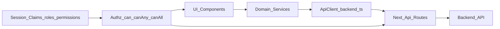

# Plano de execução frontend (escopo total)

## Objetivo
Implementar uma base consistente no frontend inteiro em 5 frentes: centralização de chamadas de API (prioridade), RBAC, testes Jest/RTL, JSDoc interno e padronização de nomes (`paciente` vs `patient` e `Appoiments` -> `Appointments`) de forma incremental.

## Fase 1 — Centralizar chamadas de API (primeiro)
- Consolidar cliente HTTP browser em [`/home/grigori/Área de trabalho/front-master/app/lib/backend.ts`](/home/grigori/Área%20de%20trabalho/front-master/app/lib/backend.ts) como ponto único para `fetch`, headers, `credentials: 'include'`, timeout/abort e normalização de erro.
- Manter e reforçar cliente server em [`/home/grigori/Área de trabalho/front-master/app/lib/backend-server.ts`](/home/grigori/Área%20de%20trabalho/front-master/app/lib/backend-server.ts) para rotas Next (`/app/api/**`).
- Criar/expandir serviços por domínio (mesmo padrão de [`/home/grigori/Área de trabalho/front-master/app/lib/whatsapp-api.ts`](/home/grigori/Área%20de%20trabalho/front-master/app/lib/whatsapp-api.ts)) para `users`, `chatbot`, `appointments`, `patient`.
- Migrar gradualmente componentes/hooks com `fetch` direto para serviços centralizados, começando por telas mais críticas: [`/home/grigori/Área de trabalho/front-master/app/shared/Chatbot.tsx`](/home/grigori/Área%20de%20trabalho/front-master/app/shared/Chatbot.tsx), [`/home/grigori/Área de trabalho/front-master/app/AppoimentsPanel/page.tsx`](/home/grigori/Área%20de%20trabalho/front-master/app/AppoimentsPanel/page.tsx), [`/home/grigori/Área de trabalho/front-master/app/shared/UsersManagementPanel.tsx`](/home/grigori/Área%20de%20trabalho/front-master/app/shared/UsersManagementPanel.tsx).
- Introduzir tipo de erro único (`ApiError`) e normalizador para payloads heterogêneos (`message/mensagem/error`, `success/sucesso`).

## Fase 2 — Implementar RBAC incremental
- Criar módulo central de autorização (`authz`) com helpers `can`, `canAny`, `canAll` e catálogo de permissões (`resource:action`).
- Integrar sessão/claims vindas de [`/home/grigori/Área de trabalho/front-master/app/api/auth/check-session/route.ts`](/home/grigori/Área%20de%20trabalho/front-master/app/api/auth/check-session/route.ts), mantendo fallback por role legado no início.
- Substituir checks inline por `role` em páginas/componentes por verificações de permissão: [`/home/grigori/Área de trabalho/front-master/app/AppoimentsPanel/page.tsx`](/home/grigori/Área%20de%20trabalho/front-master/app/AppoimentsPanel/page.tsx), [`/home/grigori/Área de trabalho/front-master/app/paciente/page.tsx`](/home/grigori/Área%20de%20trabalho/front-master/app/paciente/page.tsx), [`/home/grigori/Área de trabalho/front-master/app/shared/DashboardTabs.tsx`](/home/grigori/Área%20de%20trabalho/front-master/app/shared/DashboardTabs.tsx).
- Endurecer `defense-in-depth` nas rotas `/app/api/admin/**` com wrapper de autorização reutilizável, além das validações do backend.

## Fase 3 — Setup e implementação de testes (Jest/RTL)
- Adicionar infraestrutura de testes (Jest + RTL + `next/jest` + `jsdom`) no projeto (`package.json`, `jest.config`, `setupTests`).
- Começar com testes de alto retorno e baixa fragilidade:
  - funções puras em [`/home/grigori/Área de trabalho/front-master/app/lib/patient-dashboard-map.ts`](/home/grigori/Área%20de%20trabalho/front-master/app/lib/patient-dashboard-map.ts);
  - helpers de API em [`/home/grigori/Área de trabalho/front-master/app/lib/backend.ts`](/home/grigori/Área%20de%20trabalho/front-master/app/lib/backend.ts).
- Depois cobrir componentes/páginas críticas com RTL: [`/home/grigori/Área de trabalho/front-master/app/paciente/page.tsx`](/home/grigori/Área%20de%20trabalho/front-master/app/paciente/page.tsx), [`/home/grigori/Área de trabalho/front-master/app/shared/PatientTabs.tsx`](/home/grigori/Área%20de%20trabalho/front-master/app/shared/PatientTabs.tsx), [`/home/grigori/Área de trabalho/front-master/app/Login/page.tsx`](/home/grigori/Área%20de%20trabalho/front-master/app/Login/page.tsx).
- Manter scripts de smoke atuais em `scripts/` como validação complementar de integração.

## Fase 4 — JSDoc interno orientado a manutenção
- Documentar funções de regra de negócio e normalização (não todo o código):
  - [`/home/grigori/Área de trabalho/front-master/app/lib/patient-dashboard-map.ts`](/home/grigori/Área%20de%20trabalho/front-master/app/lib/patient-dashboard-map.ts);
  - [`/home/grigori/Área de trabalho/front-master/app/lib/backend.ts`](/home/grigori/Área%20de%20trabalho/front-master/app/lib/backend.ts);
  - [`/home/grigori/Área de trabalho/front-master/app/api/patient/dashboard/route.ts`](/home/grigori/Área%20de%20trabalho/front-master/app/api/patient/dashboard/route.ts).
- Padronizar JSDoc para: contrato de entrada/saída, regras implícitas, fallback, erros esperados e efeitos colaterais.

## Fase 5 — Padronização de nomes (compatível)
- Definir padrão oficial:
  - rotas e UX públicas em PT-BR (`/paciente`);
  - código interno (tipos/arquivos/símbolos) em EN (`patient`, `appointment`).
- Corrigir gradualmente o legado `Appoiments*` para `Appointments*` com aliases temporários para evitar quebra de imports.
- Manter compatibilidade de rotas legadas (ex.: `/Patients` -> `/paciente`) até estabilizar testes e monitorar regressões.

## Sequência recomendada de rollout
1. API centralizada (base técnica para todo o resto).
2. RBAC em UI + rotas API internas.
3. Testes em núcleos críticos e fluxos de acesso.
4. JSDoc nos pontos de regra/contrato.
5. Naming cleanup com aliases e remoção progressiva.

## Fluxo alvo (arquitetura)

## Critérios de aceite por fase
- API: nenhum `fetch` direto em módulos priorizados; erros normalizados; sessão preservada.
- RBAC: decisões de acesso via `can(...)`; bloqueios coerentes em UI e rotas internas.
- Testes: suíte Jest/RTL executando em CI local com cobertura inicial dos módulos críticos.
- JSDoc: funções-chave documentadas com contratos claros.
- Naming: novos arquivos/símbolos no padrão; aliases legados funcionando durante transição.